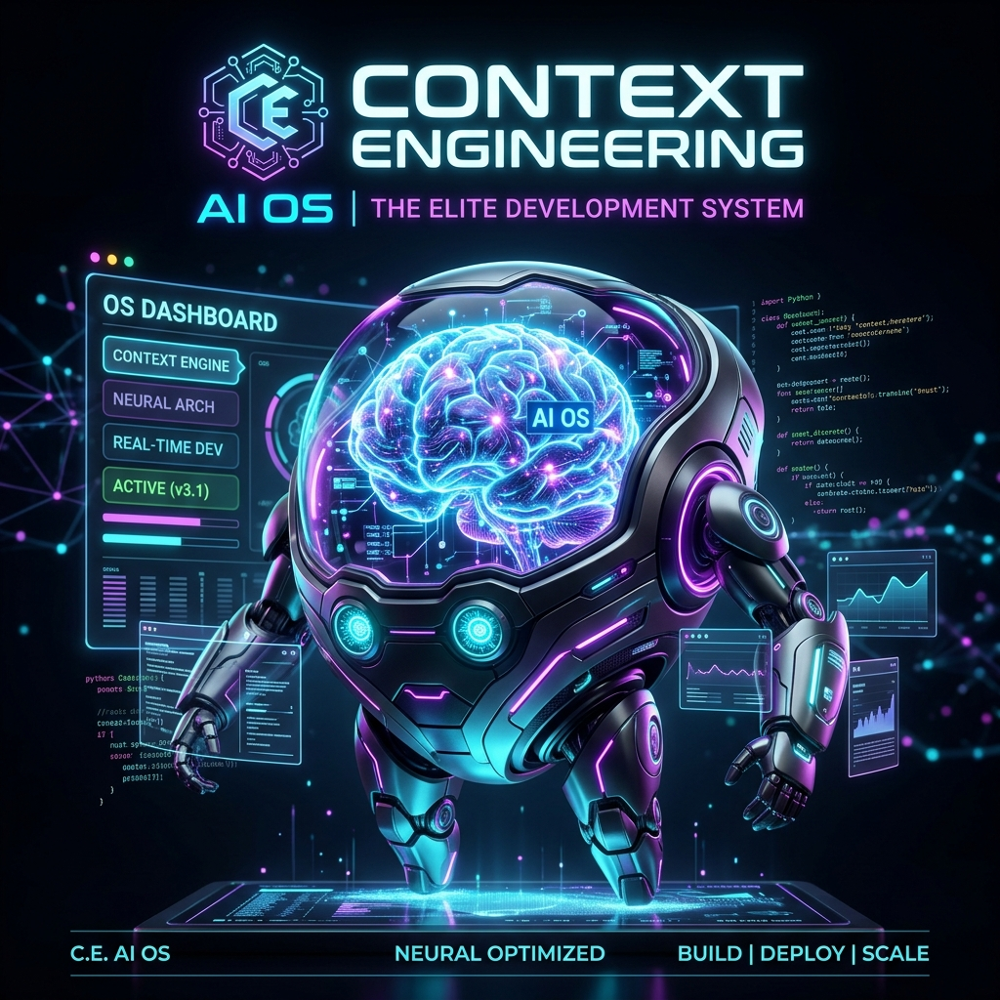
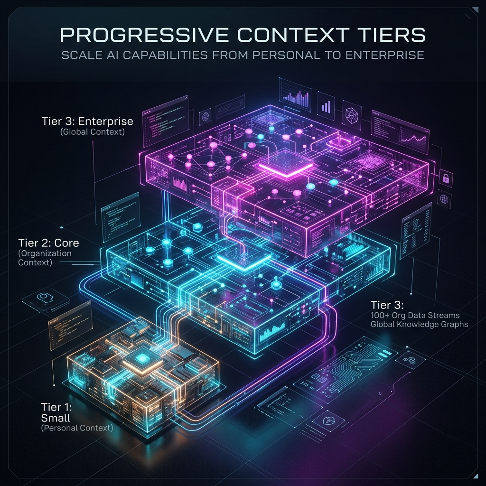

<p align="center"></p>

# 🧠 Context Engineer Por
> **The Elite Context Engineering OS.** Never let your AI agents suffer from context rot or amnesia again.

Are your AI agents forgetting instructions? Writing bloated files? Crashing due to token limits? **Context Engineer Por** is the ultimate AI architecture skill that mathematically limits context size and enforces "Progressive Context Tiers" across your entire workspace.

---

## ✨ Why You Need This
- 🚫 **Zero-Bloat Assurance:** Forces agents to use standard libraries instead of writing boilerplate.
- 📉 **Context Compression:** Instantly trims `AGENTS.md` and `.cursorrules` to their highest-signal state.
- 🤝 **Cross-IDE Compatible:** Works universally with Antigravity CLI, Cursor, Windsurf, and Claude Code.

---

## 🏗️ The Progressive Architecture

<p align="center"></p>

This OS automatically scales based on the size of your project:
1. **Tier 1 (Small Scripts):** Tiny routing files. High speed, low token usage.
2. **Tier 2 (Core Projects):** Adds the `Write-or-Die` learning loops and session handoffs.
3. **Tier 3 (Enterprise):** Deploys the deep-reference `LAWS.md` and rigorous tripwire integrations.

---

## 🚀 Quick Start & Installation

You are just one command away from elite context engineering.

```bash
# Clone the skill directly into your global agent toolkit
git clone https://github.com/christpor/context-engineer-por.git ~/.gemini/config/skills/context-engineer-por
```

### How to Trigger the Skill
Once installed, just open your terminal or AI IDE and paste this prompt:

> *"Please set up the context architecture for this project using the context-engineer-por skill."*

The OS will automatically take over, run a **Phase 0 Silent Audit** of your codebase, and build the exact context tier you need.

---
### ⚖️ License
This operating system is released under the **MIT License**. Build securely!
