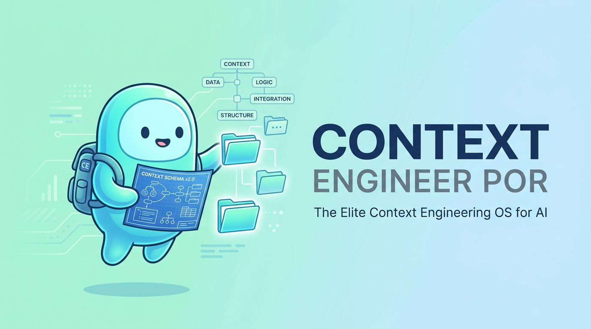
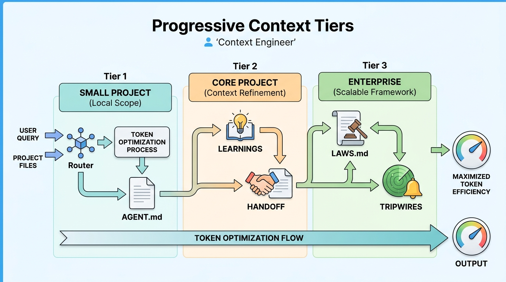

<p align="center">
  
</p>

The Elite Context Engineering OS. Mathematically trim agent token bloat and optimize cognitive capacity using Progressive Context Tiers.

<p align="left">
  
  
  
</p>

## 🚀 Quick Start
Instantly inject the Context Engineer OS into your AI workspace (Claude Code, Cursor, Windsurf, or Antigravity CLI):

```bash
cp SKILL.md .agents/SKILL_CONTEXT_ENGINEER.md
```

---

<p align="center">
  
</p>

## ⚡ Core Law
> *"Context is a finite attention budget. Every token competes with every other token. More context ≠ better. Past a threshold, extra tokens actively degrade reasoning. Goal: smallest set of high-signal tokens = maximum output quality."*

<details>
<summary><b>🧠 Universal Vocabulary & Routing (Click to Expand)</b></summary>
<br>

| Universal Term | Claude Code | Cursor | GitHub Copilot | Windsurf | Antigravity CLI |
|---------------|-------------|--------|----------------|----------|-----------------|
| **Router File** | `CLAUDE.md` | `.cursorrules` | `.github/copilot-instructions.md` | `.windsurfrules` | `AGENTS.md` |
| **Agent Brain** | `context/AGENT.md` | same | same | same | same |
| **Compress Context** | `/compact` | New chat | New chat | New chat | New chat |

### The Silent Audit constraints:
1. **Zero-Delta Baseline:** Prove mathematically why existing native features failed before writing a new file.
2. **Cross-Skill Isolation:** Never hallucinate modules.
3. **Byte-Stable Caching:** Keep heavy system instructions at the absolute top of the file to maximize cache hits.

</details>

## 📄 License
MIT License © 2026 Christpor
