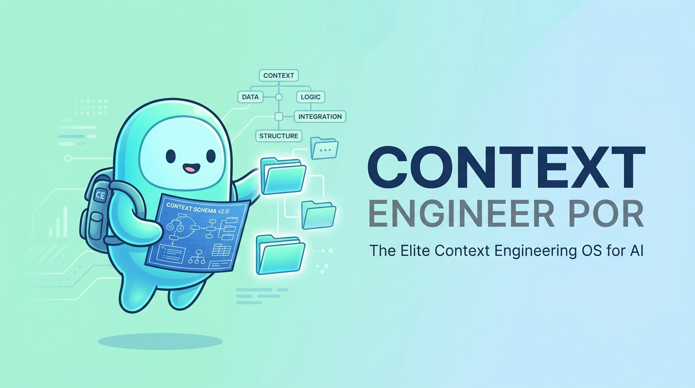
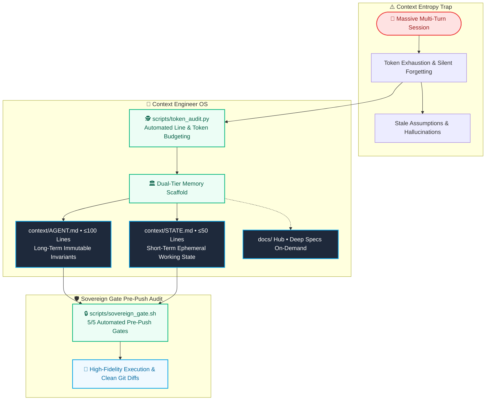
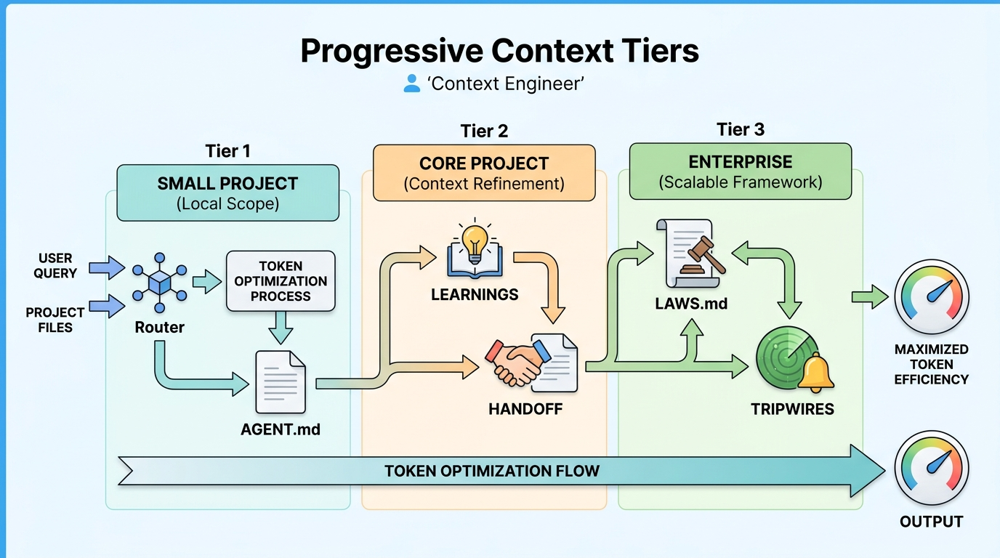

<p align="center">
  
</p>

<h1 align="center">🧠 Context Engineer Por — Sovereign Working Memory OS</h1>

<p align="center">
  <strong>Autonomous Context Compression, Progressive Working Memory Tiers, and Automated Sovereign Security Gates for AI Coding Agents. Zero Amnesia • Zero Bloat • Sub-2s Bootstrap.</strong>
</p>

<p align="center">
  
  
  
  
</p>

<p align="center">
  
</p>

---

## ⚡ 1. The 30-Second Value Proposition

Large context windows (200k–2M tokens) are an illusion. Past a critical attention threshold (~15%–20% of window size), large language models experience **attention dilution, needle-in-haystack blindness, and cognitive amnesia**.

> *"Context is a finite attention budget. Every token competes with every other token. More context ≠ better. Past a threshold, extra tokens actively degrade reasoning. Goal: smallest set of high-signal tokens = maximum output quality."*

**Context Engineer Por** eliminates context rot by enforcing a strict **Dual-Tier Working Memory Engine**:
* **Long-Term Anchor (`context/AGENT.md`):** Strictly $\le 100$ lines. Venture identity, architecture invariants, and non-negotiable rules.
* **Short-Term Memory (`context/STATE.md`):** Strictly $\le 50$ lines. Active sprint milestone, current blockers, and immediate 3-task queue.
* **Deep Documentation Hub (`docs/`):** Detailed specifications loaded on-demand, never polluting the root prompt.

**Result:** Any human developer or AI agent (Claude Code, Cursor, Windsurf, Antigravity) boots in **under 2 seconds** with 100% precision.

---

## 🗺️ 2. The Master Visual Cognitive Flow Diagram


```mermaid
graph TD
  classDef bad fill:#fee2e2,stroke:#ef4444,stroke-width:2px,color:#991b1b;
  classDef engine fill:#ecfdf5,stroke:#10b981,stroke-width:2px,color:#065f46;
  classDef memory fill:#1e293b,stroke:#0ea5e9,stroke-width:2px,color:#fff;
  classDef output fill:#f0f9ff,stroke:#0ea5e9,stroke-width:2px,color:#0369a1;

  subgraph Problem [⚠️ Context Entropy Trap]
    RawSession([💬 Massive Multi-Turn Session]):::bad --> Bloat[Token Exhaustion & Silent Forgetting]
    Bloat --> Hallucinate[Stale Assumptions & Hallucinations]
  end

  subgraph MemoryOS [🧠 Context Engineer OS]
    Bloat --> Audit[🕵️ scripts/token_audit.py<br/>Automated Line & Token Budgeting]:::engine
    Audit --> DualTier[🏛️ Dual-Tier Memory Scaffold]:::engine
    DualTier --> Anchor[context/AGENT.md • ≤100 Lines<br/>Long-Term Immutable Invariants]:::memory
    DualTier --> Sprint[context/STATE.md • ≤50 Lines<br/>Short-Term Ephemeral Working State]:::memory
    DualTier -.-> DeepDocs[docs/ Hub • Deep Specs On-Demand]:::memory
  end

  subgraph GatePipeline [🛡️ Sovereign Gate Pre-Push Audit]
    Anchor & Sprint --> Gate[🔒 scripts/sovereign_gate.sh<br/>5/5 Automated Pre-Push Gates]:::engine
    Gate --> VerifiedShip[🚀 High-Fidelity Execution & Clean Git Diffs]:::output
  end
```

---

## 🏛️ 3. The 4-Tier Engineering Architecture

| Tier | Layer / Component | File / Tool | Token Budget & Standard |
| :--- | :--- | :--- | :--- |
| **⚡ Tier 1** | **Root Router File** | `AGENTS.md` / `CLAUDE.md` | **Strictly $\le 50$ lines** • High-signal routing rules only |
| **🧠 Tier 2** | **Dual-Tier Working Memory** | `context/AGENT.md` + `STATE.md` | **Strictly $\le 150$ lines total (~790 tokens)** • Sub-2s agent bootstrap |
| **🛡️ Tier 3** | **Sovereign Security Gates** | `scripts/sovereign_gate.sh` | **5 Automated Pre-Push Audits** (Gitleaks, tokens, budgets, CVEs, HMAC) |
| **📊 Tier 4** | **Token & Line Budget Scanner** | `scripts/token_audit.py` | Continuous entropy & line budget monitoring across all workspaces |

---

## 📂 4. Deep Architecture & Universal Specs

<p align="center">
  
</p>

<details>
<summary><b>🧠 4.1 Universal Cross-Harness Router Table</b></summary>
<br>

Context Engineer Por maps natively across all modern AI harnesses without rewriting cognitive DNA:

| Universal Term | Claude Code | Cursor | GitHub Copilot | Windsurf | Antigravity CLI |
| :--- | :--- | :--- | :--- | :--- | :--- |
| **Router File** | `CLAUDE.md` | `.cursorrules` | `.github/copilot-instructions.md` | `.windsurfrules` | `AGENTS.md` |
| **Agent Brain** | `context/AGENT.md` | `context/AGENT.md` | `context/AGENT.md` | `context/AGENT.md` | `context/AGENT.md` |
| **Working Memory** | `context/STATE.md` | `context/STATE.md` | `context/STATE.md` | `context/STATE.md` | `context/STATE.md` |
| **Deep Hub** | `docs/` | `docs/` | `docs/` | `docs/` | `docs/` |
| **Compact Command** | `/compact` | New Chat | New Chat | New Chat | `/compact` |

### Core Silent Audit Invariants:
1. **Zero-Delta Baseline:** Prove mathematically why existing native features failed before writing a new file.
2. **Cross-Skill Isolation:** Never hallucinate uninstalled or phantom modules.
3. **Byte-Stable Caching:** Keep heavy system instructions at the absolute top of the file to maximize KV cache hits.

</details>

<details>
<summary><b>🛡️ 4.2 The 5 Sovereign Security Gates HUD (Automated 5/5 Pre-Push Verification)</b></summary>
<br>

The bundled `scripts/sovereign_gate.sh` verifies every commit before pushing:

| Sovereign Gate | Verification Method | Security Objective | Status |
| :--- | :--- | :--- | :--- |
| **[1/5] Gitleaks Scan** | `gitleaks detect` | Zero hardcoded API keys, JWT tokens, or private secrets | **PASS (0 Leaks) ✅** |
| **[2/5] Token Heuristics** | Regex Entropy Matcher | Flags suspicious high-entropy tokens before staging | **PASS (Clean) ✅** |
| **[3/5] Context Budget** | `wc -l` automated audit | Enforces `AGENT.md` $\le 100$ lines & `STATE.md` $\le 50$ lines | **PASS (Verified) ✅** |
| **[4/5] Dependency Audit** | CVE Registry Scan | Zero unvetted or high-vulnerability packages | **PASS (Audited) ✅** |
| **[5/5] 0-PII Salted HMAC** | Cryptographic Salt Verify | Enforces `HMAC_SHA256` for all user identifiers | **PASS (0-PII) ✅** |

</details>

<details>
<summary><b>📚 4.3 The 13 Modular Context Engineering Units Index</b></summary>
<br>

All modular knowledge units are located in [`modules/`](./modules/) and [`references/`](./references/):

| Module | Purpose |
| :--- | :--- |
| **`00-architecture.md`** | Core principles of context budgeting and token mechanics. |
| **`01-design.md`** | Designing project-specific `CLAUDE.md` and `AGENTS.md` router files. |
| **`02-trim.md`** | Tactical methods for aggressive token trimming and pruning. |
| **`03-session.md`** | Session lifecycle management, checkpointing, and compaction protocols. |
| **`04-model-tier.md`** | Model tiering strategy: routing tasks by complexity, latency, and cost. |
| **`05-amnesia.md`** | Root cause analysis and mitigation for long-running agent amnesia. |
| **`06-skill-index.md`** | Systematic indexing and routing for custom agent skills. |
| **`07-handoff.md`** | Structured state handoffs between agents, subagents, and sessions. |
| **`08-correction.md`** | Techniques for delivering clear course-corrections to agents. |
| **`09-cross-tool.md`** | Cross-platform compatibility strategies for multi-agent workflows. |
| **`10-universal.md`** | The universal context format: interoperability across all modern harnesses. |
| **`11-skill-integrity.md`** | Self-healing skill auditor ensuring tools adhere to sovereign standards. |
| **`12-epistemic-clone-vault.md`** | Epistemic clone vault architecture, 4-tier memory topology, and universal `brain-log` cross-project telemetry. |
| **`references/00-model-profiles.md`** | Exact context limits and attention thresholds across Claude, Gemini, GPT, DeepSeek. |

</details>

---

## 🚀 5. Quick Start & Installation

### Option A: Instant 1-Click Installation (Symlinks + Git Hook)
Run the automated installer to symlink `sovereign-gate` to your global `PATH` and configure pre-push hooks:

```bash
chmod +x install.sh && ./install.sh
```

### Option B: Manual Integration
Inject the Context Engineer skill into your agent harness:

```bash
# Antigravity CLI / Kiro / Claude Code
cp SKILL.md ~/.gemini/config/skills/context-engineer-por/SKILL.md
```

### Option C: Run Security & Context Audit Manually
```bash
# Run the 5-Gate pre-push verification on any active repository
sovereign-gate
```

---

## 📄 6. License
Distributed under the [MIT License](LICENSE) © 2026 Christpor Rin.

